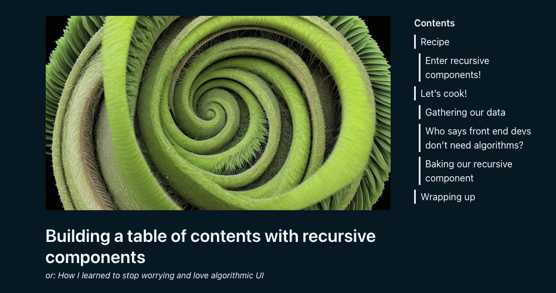

I _finally_ did the thing! After putting it off, proctrastinating by staring at other people's sites in the name of _"research"_, I did it - I built a blog! And in doing so, I found a neat little topic to write about.

On my quest for inspiration I noted some blogging sites have a nifty little table of contents feature that take the headings from the article, and spit out a nested list of links to each section. I **_had_** to have one for my own site.

If you look to your right and your display is big enough you should see exatly what I'm talking about.

#### What are we cooking with?

I built this site using [Astro](https://astro.build), TypeScript, [Tailwind CSS](https://tailwindcss.com). It's a staticly generated site, but these concepts don't look too different in frameworks like React, Vue, or Svelte.

## Recipe

To pull this off we're going to need a couple of things

- the list of headings in our document
- a function to convert them into a data structure that represents their hierarchy
- a UI component that can nest itself within... itself... hmm

That last item looks a little hairy. As front-end developers we're used to taking an array of items and rendering out a list of components, we do it all day. But how do we render subsequent items as children of previous items?

### Enter recursive components!

Aaah, I gave it away in the title. But still, that was pretty good, right?

A recursive function is a function that calls itself, until we meet some kind of base condition. A simple example is a function that simply counts backwards from a given number.

```ts
function countBack(num) {
  // base case - we stop if num <= 0
  if (num > 0) {
    console.log(num);
    // recurse
    // call again with decremented input
    countBack(num - 1);
  }
}
```

Components are just functions, of course we can have them call themselves!

Recursive components are great when you need to render some kind of hierarchical structure. You could use them for things like:

- threaded comments
- nested app menus
- directory/folder structures

And, importantly for us, to generate an outline of a document.

## Let's cook!

Alright, we know what we're cooking, we have a list of ingredients, and we understand recursion. First we'll mise en place and get our data ready

### Gathering our data

I'm using [Astro's content collections](https://docs.astro.build/en/guides/content-collections) to handle organisation and metadata validation (the frontmatter) of my posts.

Handily, entries from content collections have a `render()` method which returns the rendered `Content`, and a list of `headings` in the entry.

So for an entry that looks like this

```md
## First heading, an H2

### H3 a sub heading of the first

#### An H4 nested even further

## New H2, section two

### Sub heading of section 2
```

We can call `render()` and get output that looks like this

```ts
const { headings } = await post.render();
// headings output
[
  {
    depth: 2,
    slug: "first-heading-an-h2",
    text: "First heading, an H2",
  },
  {
    depth: 3,
    slug: "h3-a-sub-heading-of-the-first",
    text: "H3 a sub heading of the first",
  },
  {
    depth: 4,
    slug: "an-h4-nested-even-further",
    text: "an H4 nested even further",
  },
  {
    depth: 2,
    slug: "a-new-top-level-heading",
    text: "A new top level heading",
  },
  {
    depth: 3,
    slug: "its-subsection",
    text: "it’s subsection",
  },
];
```

The keen eyed among you have probably already noted the `depth` key, and that it correlates to the heading levels we specified in our markdown. Easy-peasy!

We should be able to transform this list into a tree structure that we can more easily process with our recursive component.

### Who says front end devs don't need algorithms?


<figcaption>I had to stop myself from just pasting in a dozen of <a href="https://vincentdnl.com/">vincentdnl's</a> comics and calling it a job well done</figcaption>

There's definitely a grain of truth in that comic. At least in my experience, when working in front-end land I never really needed much in the way of algorithms. If you use the right data structures everything just kind of falls into place.

But ultimately, even if it's abstracted away by a fancy framework, we're just working with a big ole tree. Now and again you'll need to know how to work with it.

This is a classic little algorithms exercise, like something you'd find on leetcode or a junior front-end dev interview.

There's a couple of approaches you can take here - I ended up settling on a solution using a stack to keep track of the depth of my tree.

```ts
function buildHeadingTree(headings) {
  const root = { depth: 0, slug: "", text: "", children: [] };
  const stack = [root];

  for (const item of headings) {
    while (item.depth <= stack[stack.length - 1].depth) {
      stack.pop();
    }

    const newNode = { ...item, children: [] };
    stack[stack.length - 1].children.push(newNode);
    stack.push(newNode);
  }

  return root.children;
}
```

Given our input above, it'll transform it into a nice tree

```ts
[
  {
    depth: 2,
    slug: "first-heading-an-h2",
    text: "First heading, an H2",
    children: [
      {
        depth: 3,
        slug: "h3-a-sub-heading-of-the-first",
        text: "H3 a sub heading of the first",
        children: [],
      },
    ],
  },
  {
    depth: 2,
    slug: "new-h2-section-two",
    text: "New H2, section two",
    children: [
      {
        depth: 3,
        slug: "sub-heading-of-section-2",
        text: "Sub heading of section 2",
        children: [],
      },
    ],
  },
];
```

### Baking our recursive component

Now we've got our data in order we just need a component to render it. This bit's actually pretty straight forward.

We just need to `map()` over our headings and return a list item for each one. If the current heading has any children, we'll call the component again with the children as the input!

```tsx
<ul>
  {headings.map((h) => (
    <li>
      <a href={`#${h.slug}`}>{h.text}</a>
      {!!h.children.length && <Astro.self headings={h.children} />}
    </li>
  ))}
</ul>
```

Astro has this `Astro.self` component which is just the current component you're writing, but if you were doing this with React you'd just call your function component by name like so

```tsx
export const RecursiveList = ({ headings }) => (
  <ul>
    {headings.map((h) => (
      <li key={h.slug}>
        <a href={`#${h.slug}`}>{h.text}</a>
        {!!h.children.length && <RecursiveList headings={h.children} />}
      </li>
    ))}
  </ul>
);
```

And it's a simple as that! Add some styles, plug it into your app, and you're done!



<figcaption>The finished product, in the night-time theme to save the eyes of anyone reading in the dark. Next up, recursive blog posts!</figcaption>

## Wrapping up

Recursive components are a great tool to have in your kitchen if you need to visualise hierarchical or tree like structures in UI.

But to make your data fit you might need to sprinkle in some spicier algorithms than you're used to - okay, this analogy is stale, I'll stop.

The source for this site is public, you can [check it out on GitHub](https://github.com/trent-howard/thwd). If you're specifically interested in the components that inspired this post, take a look in the [/src/components/post](https://github.com/trent-howard/thwd/tree/main/src/components/post) directory. I'll try to keep this updated if I ever move them around!
